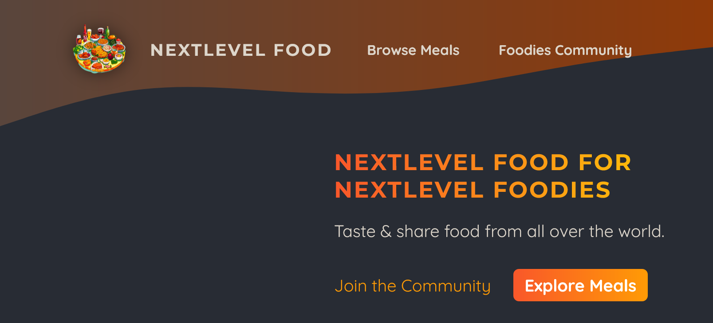
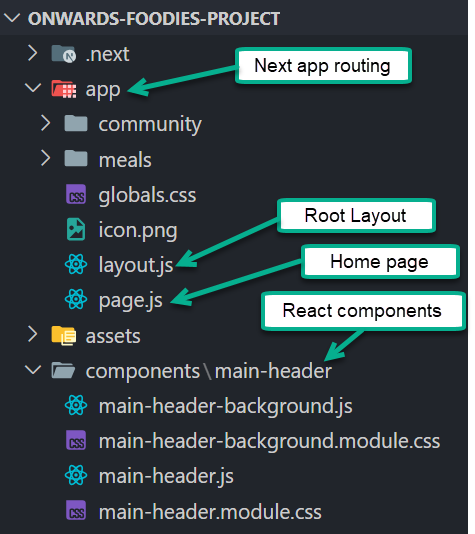
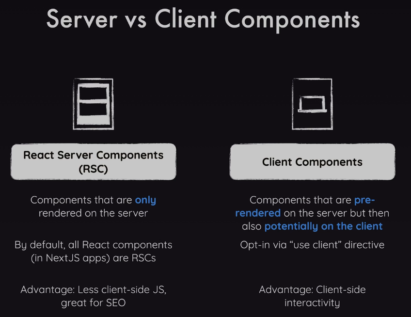
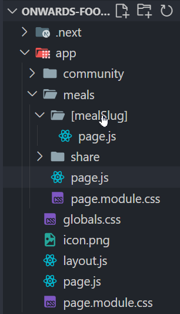
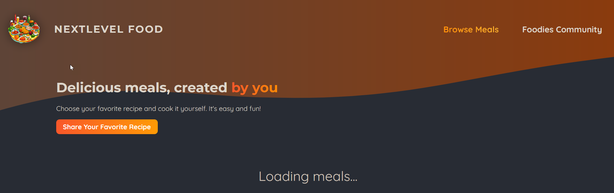
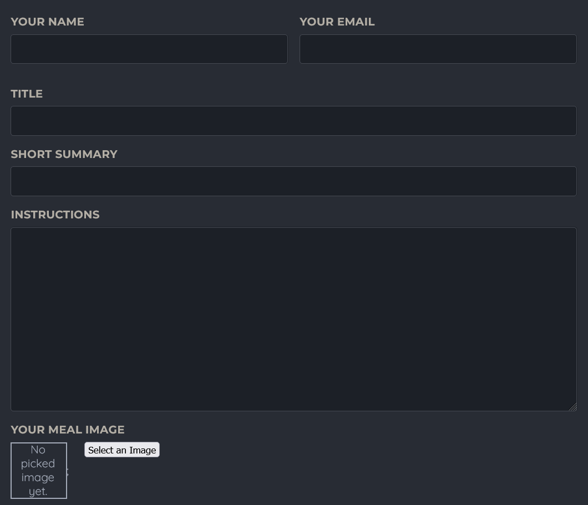
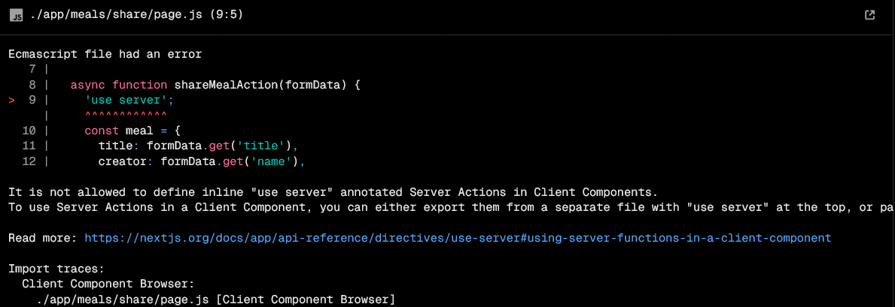
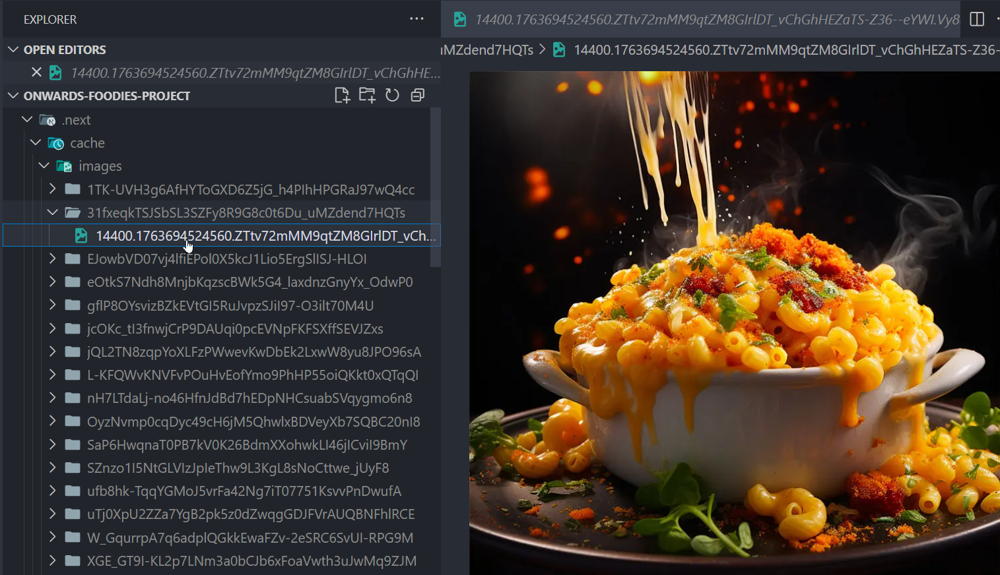

1. [Overview](#overview)
2. [Server Side vs Client Side React](#server-side-vs-client-side-react)
3. [Next pathName Hook](#next-pathname-hook)
   1. [Initial Implementation](#initial-implementation)
   2. [Alternative Implementation](#alternative-implementation)
4. [Dynamic Content Overview](#dynamic-content-overview)
   1. [MealGrid Component](#mealgrid-component)
   2. [MealItem Component](#mealitem-component)
5. [SQLLite Database Implementation](#sqllite-database-implementation)
   1. [As Installed in the App](#as-installed-in-the-app)
   2. [Server Side Component Notes](#server-side-component-notes)
   3. [Implementing the meals Database](#implementing-the-meals-database)
   4. [The Loading Message](#the-loading-message)
   5. [Using the Suspense Component](#using-the-suspense-component)
6. [Next Reserved Pages](#next-reserved-pages)
   1. [Error Handling](#error-handling)
   2. [Not Found Error Page](#not-found-error-page)
   3. [Not Found Navigation Function](#not-found-navigation-function)
7. [Dynamic Page Routing](#dynamic-page-routing)
   1. [Using the mealSlug Parameter](#using-the-mealslug-parameter)
   2. [Using dangerouslySetInnerHTML](#using-dangerouslysetinnerhtml)
8. [Image Picker](#image-picker)
   1. [The File Input Element](#the-file-input-element)
   2. [ImagePicker Event Handlers](#imagepicker-event-handlers)
   3. [Upload File Size Limit](#upload-file-size-limit)
9. [Form Submission](#form-submission)
   1. [Separate Server Actions](#separate-server-actions)
   2. [Storing Server Data](#storing-server-data)
   3. [The useFormStatus Hook](#the-useformstatus-hook)
   4. [Validation via the useActionState Hook](#validation-via-the-useactionstate-hook)
10. [Building for Production](#building-for-production)
    1. [Revalidating the Paths](#revalidating-the-paths)
    2. [Uploading Images to the App Website](#uploading-images-to-the-app-website)
    3. [Adding metadata Object to Pages](#adding-metadata-object-to-pages)

---

# Overview

This is a build of a nextJS Foodies project that will capture posts of food recipes. There are pages for favorite meals, and a Foodies community containing the meal shared in the food posts. Below is the Home page output.



The project is structured such that Next pages are separated into the `@/app` folder (of course) for things that Next will route and React components in the `@/components` folder.

In the `app` folder there are two principal folders: `community` and `meals`. Within meals there are sub-folders, one of them with dynamic content. 



# Server Side vs Client Side React
React components will be rendered (or pre-rendered) by Next but some can only execute in the browser.



- React components with `useEffect` or `useState`, for example
- Another case are `event handlers` (e.g. **1. [Overview](#overview)
2. [Server Side vs Client Side React](#server-side-vs-client-side-react)
**) requiring user interaction
- A `'use client';` directive must be added to the client side component to differentiate a client side React component. 

# Next pathName Hook

The `main-header.js` displays various links at the top of the page (*Browse Meals* and *Foodies Community*). They should be highlighted if the user navigates to either of those two pages. It's easy to do with the use of the Next `usePathname` hook. 

## Initial Implementation

The example below sets the CSS `active` class based on the path name returned from the hook. The main-header.js file is defined with the use client directive. **This approach works, but see the alternative implementation.**

```javascript
'use client';
import { usePathname } from "next/navigation";
...
export default function MainHeader() {
  const pathName = usePathname();
  return (
  ...
        <nav className={ styles.nav }>
          <ul>
            <li>
              <Link href="/meals" className={ pathName.startsWith("/meals") ? styles.active : undefined }>Browse Meals</Link>
            </li>
            <li>
              <Link href="/community" className={ pathName === "/community" ? styles.active : undefined }>Foodies Community</Link>
            </li>
          </ul>
  
```

## Alternative Implementation

It's only the links **li elements** that need the `use client` directive. Therefore, a new component called `NavLink` was created to implement the `li` elements that require client side rendering. 

A little refactoring produced the NavLink client side component show below. A separate `nav-link.module.css` file was created to contain the `active` CSS class.

```javascript
'use client';
import Link from 'next/link';
import { usePathname } from 'next/navigation';
import styles from './nav-link.module.css';

export default function NavLink({ href, children }) {
  const pathName = usePathname();
  return (
    <li>
      <Link
        href={ href }
        className={ pathName.startsWith(href) ? styles.active : undefined }>
        { children }
      </Link>
    </li>

  );
}
```

The updated main-header nav element was simplified to the snippet below. The 'use client' directive was removed.

```javascript
        <nav className={ styles.nav }>
          <ul>
            <NavLink href="/meals">
              Browse Meals
            </NavLink>
            <NavLink href="/community">
              Foodies Community
            </NavLink>
          </ul>
        </nav>
```

# Dynamic Content Overview

A `slug` refers web development term to refer to a human-readable, URL-friendly content, such as a blog post, product, or category page. For example, in the URL `www.myblog.com/blogs/tossed-salad`, `tossed-salad` is the slug.  It's the **part of the URL that specifically identifies a dynamic resource**.  

As shown below, the `[mealSlug]` identifier provides this project with a means to dynamically create instances of meal blog submissions. This section only covers how to render the blogs on a page. 

How to create the `mealSlug` page content itself is described in the [dynamic page routing](#dynamic-page-routing) section further down. 



## MealGrid Component

The *@/components/meals/meals-grid.js* file contains the `MealsGrid` component that produces a list of meal blogs which are to be retrieved from a database covered in the next section. As shown below, the component get a props parameter containing an array of meals, and each meal is sent to a `MealItem`. 

```javascript
export default function MealsGrid({ meals }) {
  return (
    <ul className={ style.meals }>
      { meals.map((meal) =>
        <li key={ meal.id }>
          <MealItem { ...meal } />
        </li>
      ) }
    </ul>
    ...
  );
```

**Note**: Notice the use of the javascript **spread operator** to cast name/value property pairs to MealItem.

## MealItem Component

The code in the @/components/meals/meal-item.js file simply renders the individual meal blog properties. However, the use of the slug property in the Link references that meal blog dynamically to the user.

```javascript
export default function MealItem({ title, slug, image, summary, creator }) {
  return (
    <article className={ classes.meal }>
      ...
      <div className={ classes.content }>
        <p className={ classes.summary }>{ summary }</p>
        <div className={ classes.actions }>
          <Link href={ `/meals/${ slug }` }>View Blog Details</Link>
        </div>
      </div>
    </article>
  );
}
```

# SQLLite Database Implementation

The Meal images are to be retrieved from a development database (not production quality). Since Next is a fullstack framework, this allows us to implement server side functionality in the app. The `better-sqlite3` package (v12) performs its operations synchronously, avoiding async loop complexity, as is the case with `node-sqlite3`. Overall performance is better with this package as well. When not to use better-sqlite3?

- You have many concurrent writes (e.g., a social media platform).
- You’re serving large read data (e.g., video streams).
- Your database is approaching terabyte size.

## As Installed in the App

- In a terminal ran the `npm install better-sqlite3` command. 
- Added `initdb.js` in the project root directory that contains the database setup.
- In a terminal, ran `node initdb.js` command to create `meals.db` (also in the root directory);

## Server Side Component Notes

In Next when defining a component it can be defined as `async` because the all Next components by default run on the server side (except those with the 'use client' declaration). In the case of better-sqlite3 it's not necessary because the requests run asynchronously. However, given we are retrieving database records, latency could be a factor, so the server side React component could be prefixed with the `async` keyword.

## Implementing the meals Database

1. Create a `@/lib/meals.js` component containing the SQL to select all rows, as shown below.

  ```javascript
    import sql from 'better-sqlite3';
    const db = sql('meals.db');

      export async function getMeals() {
      await new Promise((resolve) => setTimeout(resolve, 2000));
      return db.prepare('SELECT * FROM meals').all();
  }
  ```
**Note**: The `await` containing the `setTimeout` function were not needed, nor the `async` qualifier on the function but were added to test a page loading message.

2. In the page.js file for the main meals page, the following was added to produce a grid containing the meals from the database.
  ```javascript
  export default async function MealsPage() {
    const meals = await getMeals();
    ...
    return (
        <main className={ styles.main }>
          <MealsGrid meals={ meals } />
        </main>
        ...
    );
  ```

## The Loading Message

Displaying a "loading" mesage is a Next feature (via the **React Suspense component**) that provides a fallback until all of its children have finished loading. In our case, Next will run a `loading.js` file whilst retrieving the meal records from the database. 

1. Next to the page accessing the database add a `loading.js` file.
2. Add some content to the new file, using an optional CSS file for formatting.

    ```javascript
    import styles from './loading.module.css';

      export default function LoadingMealsPage() {
      return (
        <p className={ styles.loading }>Loading meals...</p>
      )};
    ```

3. Although a server component by default, it can be used on the client side through a `use client` directive.

## Using the Suspense Component

Alternatively to the loading.js file, the Suspense component can be added to the page where there may be a need for a loading message and wrap that functionality in the `<Suspense>` component.

Note: It's a little more work but in this case there were parts of the page that were not being shown using the loading.js file approch. Using the Suspense component however, the loading message will be shown below some information that should be shown on the page (e.g. the Share Your Favorite Recipe button).

1. **Rename the loading.js file**, as it is a reserved file name for Next.
2. Create an embedded component (e.g. `GetMeals`) inside page.js and move the database retrieval and return output into it, as shown below.

    ```javascript
    export default function MealsPage() {
      async function GetMeals() {
        const meals = await getMeals();
        return (
          <MealsGrid meals={ meals } />
        );
      }
      ...
    ```

3. Import the React `<Suspense>` component and where the MealsGrid used to be performed, replace it with the Suspense and GetMeals components, as shown below.
  
```javascript
  ...
  <main className={ styles.main }>
    <Suspense fallback={ <p className={ styles.loading }>Loading meals...</p> }>
      <GetMeals />
    </Suspense>
  </main>
  ...
```

4. It was necessary to copy the CSS style info from the `loading.module.css` file into the `page.module.css` file as well.

Now only the content not affected by the loading will be rendered.



# Next Reserved Pages

Other than page.js, there are several other pages that have special purposes for error handling and not-found conditions.

## Error Handling

The `error.js` file can be used to provide information when an error occurs, e.g. retrieving meal data. This file be be rendered depending on where it is located in the app project. In our case, in the `@/app/meals` directory. 

  ```javascript
  'use client';
  export default function Error({ error }) {
    return (
      <main>
        <h3>An error has occurred!</h3>
        <p>Unable to retrieve Meals data from the database.</p>
      </main>
    )
  }
  ```

  **Note**: Next assumes the error.js file can be used for both server- and client-side rendering so the `use client` directive must be specified for the error page.

## Not Found Error Page

Like the error page, the not-found.js file can be located anywhere. Generally it is located in the root directory so it is used globally.

```javascript
export default function NotFound() {
  return (
    <main className="notFound">
      <h4>Not Found Error!</h4>
      <p>The request page or resource was not found.</p>
    </main>

  );
}
```
## Not Found Navigation Function

Conditional logic can implement the not-found.js page functionality as well. Take this case where not finding a meal blog should render a not-found message.

```javascript
import { notFound } from 'next/navigation';

export default async function MealDetails({ params }) {
  const { mealSlug } = await params;
  const mealBlog = getMeal(mealSlug);
  if (!mealBlog) {
    notFound();
  }
  ... // remainder of logic is bypassed if no meal blog returned
```

# Dynamic Page Routing

In the project there are meal blogs saved in a database that represent blogs submitted by foodies. 

## Using the mealSlug Parameter

The `app/meals/[mealSlog]` is where such dynamic content can be rendered for the blog submissions. The `mealSlog` in the page URL provides an identifier of a meal blog that can be returned from the database containing the blogs.

```javascript
export default async function MealDetails({ params }) {
  const { mealSlug } = await params;
  const mealBlog = getMeal(mealSlug);
  ...
```

The `@/lib/meals.js` file contains a function that returns the meal blog details, based on the `slug` argument. (in the SQL a parameter is bound in the query to prevent sql injection.)

```javascript
export async function getMeal(slug) {
  return db.prepare('SELECT * FROM meals WHERE slug=?').get(slug);
}
```

**Notes**: 

- The `mealSlug` parameter represents a human-readable, distinct url parameter that identifies the dynamic meal blog entry in the database.

-  To retrieve `mealSlug` from the `params` property requires a promise (i.e. `await`), which requires the page.js function to be `async`.
-  

## Using dangerouslySetInnerHTML 

The name of the React `dangerouslySetInnerHTML` attribute (extension of HTML element `innerHTML`) is a reminder that use of it could possibly expose javascript vulnerabilities if missused. In the case of this project however, the innerHTML was being used to display meal blog HTML instructions. 

```javascript
...
const brInstructions = mealBlog.instructions.replace(/\n/g, '<br />');

  return (
    <>
      <header className={ styles.header }>
        <div className={ styles.image }>
          <Image src={ mealBlog.image } fill alt={ mealBlog.title } />
        </div>
        <div className={ styles.headerText }>
          <h1>{ mealBlog.title }</h1>
          <p className={ styles.creator }>
            by <a href={ `mailto:${ mealBlog.creatorEmail }` }>{ mealBlog.creator }</a>
          </p>
          <p className={ styles.summary }>{ mealBlog.summary }</p>
        </div>
      </header>
      <main>
        <p className={ styles.instructions } dangerouslySetInnerHTML={ {
          __html: brInstructions,
        } }>

        </p>
      </main>
    </>
  );
}
```

# Image Picker

The `@/app/meals/share/page.js` file implements the `SharedMealPage` which contains a form where the user can enter a new meal to be shared in the app. 



At the bottom of the page is an area where a food meal image is uploaded. This is done with the `ImagePicker` component shown below.

```javascript
  ...
      <ImagePicker label='Your Meal Image' name='image' />
      <p className={ styles.actions }>
        <button type="submit">Share Meal</button>
      </p>
    </form>
  ...
```

The `ImagePicker` React component is defined in the `@/components/meals/image-picker.js` 
file. As shown above, the label and name props are passed to the component and rendered by the component.

## The File Input Element

In the `ImagePicker` component, the most important code to understand is the `<input>` element, as shown below.

```javascript
  ...
    <input
      className={ styles.input } 
      type='file'
      id='image'
      name={ name }
      accept='image/png, image/jpg'
      ref={ imageRef }
      onChange={ imageChangeHandler }
      required
    />
    <button type='button' className='button' onClick={ uploadButtonHandler }>
      Select an Image
    </button>
  ...
```

**Notes**: 

- The `input` CSS className consists solely of a `display: none` property to **NOT** render the input field and the default button provided by the file input element.

- The React `useRef` hook defines a reference (`imageRef`) to the input field. 

## ImagePicker Event Handlers

The `onClick` event of the upload button references the `uploadButtonHandler` embedded function that will trigger a `click` event on the input field, to open the file selection dialog.

```javascript
  function uploadButtonHandler() {
  imageRef.current.click();
}
```

The input element `onChange` event is where the magic happens, after the user has selected the file to be uploaded.

```javascript
  ...
  function imageChangeHandler(event) {
    const file = event.target.files[0];
    if (!file) {
      setPickedImage(null);
      return;
    }

    const fileReader = new FileReader();
    fileReader.readAsDataURL(file);

    fileReader.onload = () => {
      setPickedImage(fileReader.result);
    };
  }
  ...
```

**Notes**: 

- The `useState` hook defines state for the file to be uploaded, as shown below.

  ```javascript
    const [pickedImage, setPickedImage] = useState(null);
  ```

- The input field `onChange` event handler returns the uploaded file from the event current target. If it is null then the `pickedImage` state is set to null (default) and simply return to the page.

- The `readAsDataURL` is **NOT** part of java FileReader interface, but is a Javascript method.
  
  - The `readAsDataURL` method will convert the input file to a base64 encoded File.

  - When this method runs it will automatically trigger an the `onload` event. 

  - The `onload` event provided callback function is where the file is saved to state using `setPickedImage`. 

  - The JSX to render the image is shown below.

  ```html
    <div className={ styles.controls }>
      <div className={ styles.preview }>
        { !pickedImage && <p>No picked image yet.</p> }
        { pickedImage && (
          <Image
            src={ pickedImage }
            alt={ name }
            fill
          />
        ) }
      </div>
  ```

## Upload File Size Limit

Whilst uploading various images, you may encounter an image file size limitation

```log
Error: Body exceeded 1mb limit.
To configure the body size limit for Server Actions, see: https://nextjs.org/docs/app/api-reference/next-config-js/serverActions#bodysizelimit
```
The solution is to update the `@/next.config.js` file and add a `bodySizeLimit` (from *1mb* to *3mb*) property, as shown below. 

**This property has been supported since Next.js v13 so it's not likely still `experimental`.** However, do not leave it out or it won't compile.

```javascript
/** @type {import('next').NextConfig} */

const nextConfig = {
  experimental: {
    serverActions: {
      bodySizeLimit: '3mb',
    },
  },
};

module.exports = nextConfig;
```

# Form Submission

In normal HTML form submission an onSubmit event is defined to collect the form data, validate it and then send it to the server. An `event.preventDefault()` is necessarily defined for the form to be processed in the browser and not submitted to the server.

However, Next provides `server actions` for handling form submission. The *preventDefault* is unnecessary as the form is already processed on the server.

```javascript
export default function ShareMealPage() {
  async function shareMealAction(formData) {
    'use server';
    const meal = {
      title: formData.get('title'),
      creator: formData.get('name'),
      creatorEmail: formData.get('email'),
      summary: formData.get('summary'),
      instructions: formData.get('instructions'),
      image: formData.get('image'),
    }
    console.log(meal);
    // add to database...
  }

  return (
    <>
      ...
      <main className={ styles.main }>
        <form className={ styles.form } action={shareMealAction}>
      ...
```

**Notes**:

- An action must run `asynchronously` and must contain the `'use server'` directive, as shown in the `shareMealAction` function.
  
- When the action is triggered on the form the action function will be *run on the server*, using input from the form contained in the `formData` argument.

- The form inputs must specify the `name` attribute for each in order for the getters to work.

## Separate Server Actions

If you are using server actions they cannot be used in a client component. For example, if the `ShareMealPage` has a `'use client'` directive then the `'use server'` function could not be included, or the following error would occur. 

  

A solution to this is to move server actions to a separate file and then import them where needed. 

```javascript
import { shareMealAction } from '@/lib/server-actions';
export default function ShareMealPage() {
  ...
}
```

Shown below is the content of the `server-actions.js` file.

```javascript
'use server';
import { redirect } from "next/navigation";
import { saveMeal } from "./meals";

export async function shareMealAction(formData) {
  const meal = {
    title: formData.get('title'),
    creator: formData.get('name'),
    creatorEmail: formData.get('email'),
    summary: formData.get('summary'),
    instructions: formData.get('instructions'),
    image: formData.get('image'),
  }
  saveMeal(meal);      /* covered in next section */
  redirect('/meals');
}
```

## Storing Server Data

When a new meal recipe is created in the app, the data is stored in several places: 

1. A database for the textual elements of the recipe. One of the elements is a meal `slug` used to render the meal contents dynamically.
2. The meal image (jpg or png) is stored in the public images section of the site.
   
There are two new packages installed to assist with saving the new meal recipe to the server:

- The `slugify` package will be used to create the slug. It is installed with the following command: `npm install slugify`. 

- Sanitization of the meal recipe `instructions` will be done to prevent a cross-site scripting attack. The xss package is installed with the `npm install xss`.

The `ShareMealRecipe` form content executes a server-action.js function that will run  the `saveMeal` function in the `@/lib/meals.js` file. The focus here is on the saveMeal function, which is shown with various notes that follow the code.

```javascript
import sql from 'better-sqlite3';
import slugify from 'slugify';
import xss from 'xss';
import fs from 'node:fs';
const db = sql('meals.db');
...
export async function saveMeal(meal) {
  // Note 1
  const slug = slugify(meal.title, { lower: true, strict: true, trim: true })

  // Note 2
  const newInstructions = xss(meal.instructions);

  // Note 3
  const extension = meal.image.name.split('.').pop();
  const imageFilename = `${ slug }.${ extension }`;
  const newImagePath = `/images/${ imageFilename }`;

  // Notes 4 and 5
  const bufferedImage = await meal.image.arrayBuffer();
  const stream = fs.createWriteStream(`public${ newImagePath }`);
  stream.write(Buffer.from(bufferedImage), (error) => {
    if (error) {
      throw new Error("Error when saving the image")
    }
  });

  // Note 6
  const insertSql = 'INSERT INTO meals'
    + ' (id, title, slug, creator, creator_email, summary, instructions, image)'
    + ' VALUES(@id, @title, @slug, @creator, @creator_email, @summary, @instructions, @image)';

  const insertStatement = db.prepare(insertSql);
  const params = {
    id: null,
    title: meal.title,
    slug: slug,
    creator: meal.creator,
    creator_email: meal.creatorEmail,
    summary: meal.summary,
    instructions: newInstructions,
    image: newImagePath
  };

  const result = insertStatement.run(params);
}
```

**Notes**:

- **Note 1**: The `slugify package` is used to render a string used for a slug. In this case three options were selected for the slug.

- **Note 2**: The xss package was used to provide some measure of *cross-site-security*. In the case used here, the meal instructions represent a possible means of inserting an attacker's javascript into the site, so xss was run on the user instructions.
  
- **Note 3**: The uploaded image is to be saved to the `@/public/images` directory and the extension is extracted from the `meal.image` object (which contains name, size, extension properties) and a newImage variable is constructed to go into the meal database record when it is inserted.

- **Notes 4 & 5**: This block of code will save the uploaded image to the `public/images` folder. 

  - **Note 4**: [The Fetch API Response object](https://developer.mozilla.org/en-US/docs/Web/API/Fetch_API) contains various instance methods, one of them being to create an arrayBuffer that provides a generic raw binary that can be used to write to the file system. As it is an async operation the `await` and `async` keywords are needed.

  - **Note 5**: Use of the [Node.js filestream module](https://nodejs.org/api/fs.html#file-system) (`fs`) which provides an interface to read or write files to the file system. 
    - First create a *writeable* stream object that defines where the file is to be written. 
    - Use the strem `write` operation to write the buffered image. The method provides a callback where errors can be handled. 

- **Note 6**: Fairly straight-forward code to insert the new meal recipe. 

  - Some effort was taken to separate out the insert SQL and the parameters (mostly for debugging purposes).
    - The SQL statement itself references bind parameters using an `@prefix`. These names must **match the names and the sequence** in the `params` object exactly.
    - Since various updates have been made to the input meal object, a new object (`params`) is created to capture the parameter values.
   
- The code in `saveMeal` can certainly be made more complete:
  - There is no error handling in this block so beware of gremlins.
  - Duplicate meal recipes can be entered. 

## The useFormStatus Hook

When the user clicks on the Share Meal button to create a new meal recipe on the server, it would be useful for the button to go from **Share Meal** to **Submitting Meal...** to let them know the server request is pending. 

The `React DOM` package provides a hook to do this: `useFormStatus`. It requires a client side component. For this reason, `@/components/meals/meal-form-submit.js` was created (show below) and then the MealFormSubmit component was incorporated into the ShareMealPage component.

```javascript
'use client';
import { useFormStatus } from "react-dom"

export default function MealFormSubmit() {
  const { pending } = useFormStatus();
  return (
    <button type="submit" disabled={ pending }>
      { pending ? 'Saving Meal' : 'Share Meal' }
    </button>
  );
}
```

**Note**: To test the delay the following 3s delay was added to the `shareMealAction` function in `@/lib/server-actions.js` just before the call to `saveMeal`. (After testing, I left a 1s delay in there for effect.)

```javascript
  await new Promise((resolve) => setTimeout(resolve, 3000));
```

## Validation via the useActionState Hook

Up to this point the only validations defined in the form was the use of the required attribute on the form inputs. Typically better validation is done via Javascript. The `useActionState` hook was used but my opinion at this point is it's more work and less sophisticated than trying to validate in a project js file. 

# Building for Production

1. Run the `npm run build` command, the application will be rebuilt, performing certain optimizations, aggressive caching strategy, like caching certain server side pages. 
   
2. Then run the `npm start` command to start the optimized production app. 

## Revalidating the Paths

If you share a new meal recipe, when you add it, the newly added shared meal will **not** appear  in the list of shared meals because it the production build created chunk of the meals page to optimize caching. 

To correct this behavior you need to use the `revalidatePath` (next/cache) function as you see below in the `shareMealAction` function `@/lib/server-actions.js` file.

  ```javascript
  ...
    saveMeal(meal);
    revalidatePath('/meals', 'layout');
    redirect('/meals');
  ...
  ```
*Notes*: 

- The 2nd revalidatePath parameter can be either `page` or `layout` where the latter will also revalidate any paths below it as well.

- After making the change you need to run the `npm run build` and `npm start` commands again. Then when you share a new meal recipe it will show up in the list immediately.

## Uploading Images to the App Website

Although the images are currently uploaded to the `public/images` folder, this **only works in the develoment build** but not for production. In production mode the public/images directory is ignored and instead the `.next/cache/images` folder is used. 



This is not a good place to keep images, even in production. Instead, images should be uploaded to hosted site like AWS S3 or to a website domain directory.

## Adding metadata Object to Pages

A useful cleanup item is to ensure each of the pages have a metadata object that describes the page. For example, the root `page.js` file has this metadata object.

```javascript
export const metadata = {
  title: 'Application Home Page',
  description: 'Welcome to the home page of Onwards Foodies',
};
```

It seems pretty meager but it will set the title in the browser tab and within the HTML there will be a `content` tag with the description in it.